# headless-agent `cordis.yml` 依赖拓扑学习笔记（完整版）

目标配置：[cordis.yml](/Users/frank_fan/Source/repos/playground/deepseek-harness/examples/headless-agent/cordis.yml)
组合图参考：[composition.md](/Users/frank_fan/Source/repos/playground/deepseek-harness/examples/headless-agent/composition.md)

> 前置：默认已掌握教程第 1~7 章基础。本笔记只聚焦这份真实组合的“依赖拓扑（谁提供、谁消费）”。

## 1. 一句话定位

这份配置是一个完整 headless coding agent 组合：
以 `agent-spine` 提供核心运行时，再叠加 LLM、持久化、子代理、工作流、todo 和文件系统工具。

---

## 2. 拓扑阅读法（先看“提供者”，再看“消费者”）

在 Cordis 里，“谁依赖谁”以 `inject` 为准；`cordis.yml` 的顺序只用于可读性。

- 服务提供者（示例）：
  - `tools`：[`super(ctx, 'tools')`](/Users/frank_fan/Source/repos/playground/deepseek-harness/packages/core/tools/src/index.ts:827)
  - `systemPrompt`：[`super(ctx, 'systemPrompt')`](/Users/frank_fan/Source/repos/playground/deepseek-harness/packages/core/system-prompt/src/index.ts:354)
  - `subagents`：[`super(ctx, 'subagents')`](/Users/frank_fan/Source/repos/playground/deepseek-harness/packages/subagent/subagent/src/index.ts:184)
  - `tokenMeter`：[`super(ctx, 'tokenMeter')`](/Users/frank_fan/Source/repos/playground/deepseek-harness/packages/llm/token-meter/src/index.ts:82)
- 服务消费者（示例）：
  - `tool-subagent`：[`inject = ['tools', 'subagents', 'systemPrompt']`](/Users/frank_fan/Source/repos/playground/deepseek-harness/packages/subagent/tool-subagent/src/index.ts:23)
  - `tool-workflow`：[`inject = ['tools', 'workflowEngine', 'systemPrompt']`](/Users/frank_fan/Source/repos/playground/deepseek-harness/packages/workflow/tool-workflow/src/index.ts:30)
  - `tool-ralph`：[`inject = ['tools', 'workflowEngine', 'subagents', 'systemPrompt']`](/Users/frank_fan/Source/repos/playground/deepseek-harness/packages/workflow/tool-ralph/src/index.ts:20)
  - `tool-fs`：[`inject = ['tools', 'fs', 'systemPrompt']`](/Users/frank_fan/Source/repos/playground/deepseek-harness/packages/fs/tool-fs/src/index.ts:22)

---

## 3. 依赖拓扑图（速查，兼容写法）

```mermaid
graph TD
  CFG["cordis.yml"]
  CORE["agent-spine core services"]
  SUBPROC["subprocess-local"]
  SUBAG["subagent service"]
  WFENG["workflow engine"]
  FSLOC["fs-local"]

  CFG --> CORE
  CFG --> SUBPROC
  CFG --> SUBAG
  CFG --> WFENG
  CFG --> FSLOC

  CFG --> LLM["llm-deepseek"]
  CFG --> BASH["bash-local"]
  CFG --> PERSIST["session-persistence-jsonl"]
  CFG --> CHECK["session-checkpoint-policy"]
  CFG --> TM["token-meter"]
  CFG --> COMP["compaction-basic"]
  CFG --> SSP["subagent-spawn-provider"]
  CFG --> SFP["subagent-fork-provider"]
  CFG --> TSUB["tool-subagent (spawn)"]
  CFG --> TSUBF["tool-subagent (fork)"]
  CFG --> TCTRL["tool-subagent-control"]
  CFG --> TREPORT["tool-subagent-report"]
  CFG --> TWF["tool-workflow"]
  CFG --> TRALPH["tool-ralph"]
  CFG --> TTODO["tool-todo"]
  CFG --> FSPOL["fs-observation-policy"]
  CFG --> TFS["tool-fs"]
  CFG --> SET["settings-file"]
  CFG --> CRE["credentials-local"]

  LLM --> CORE
  BASH --> SUBPROC
  PERSIST --> CORE
  CHECK --> CORE
  TM --> CORE
  COMP --> CORE
  COMP --> TM
  SSP --> SUBAG
  SFP --> SUBAG
  TSUB --> CORE
  TSUB --> SUBAG
  TSUBF --> CORE
  TSUBF --> SUBAG
  TCTRL --> CORE
  TCTRL --> SUBAG
  TREPORT --> CORE
  TREPORT --> SUBAG
  WFENG --> SUBAG
  TWF --> CORE
  TWF --> WFENG
  TRALPH --> CORE
  TRALPH --> WFENG
  TRALPH --> SUBAG
  TTODO --> CORE
  TFS --> CORE
  TFS --> FSLOC
  FSPOL --> TFS
  LLM -. reads .-> SET
  LLM -. reads .-> CRE
```



如果你的渲染器仍不支持 Mermaid，可用下面这版文本拓扑：

```text
cordis.yml
 ├─ agent-spine core services
 ├─ subprocess-local -> bash-local
 ├─ llm-deepseek -> core services (reads settings/credentials)
 ├─ session-persistence-jsonl -> core services
 ├─ session-checkpoint-policy -> core services
 ├─ token-meter -> core services
 ├─ compaction-basic -> core services + token-meter
 ├─ subagent service
 │   ├─ subagent-spawn-provider
 │   ├─ subagent-fork-provider
 │   ├─ tool-subagent (spawn)
 │   ├─ tool-subagent (fork)
 │   ├─ tool-subagent-control
 │   └─ tool-subagent-report
 ├─ workflow engine -> subagent service
 │   ├─ tool-workflow -> core services + workflow engine
 │   └─ tool-ralph -> core services + workflow engine + subagent service
 └─ fs-local
     ├─ tool-fs -> core services + fs-local
     └─ fs-observation-policy -> tool-fs
```

---

## 4. 关键链路（面试最常问）

1. **LLM 请求链**
   `agent-spine` 提供 `llm` 能力基座 -> `llm-deepseek` 挂官方 provider 路由并按请求解析密钥/设置。
   入口：[`inject = ['llm']`](/Users/frank_fan/Source/repos/playground/deepseek-harness/packages/llm/llm-deepseek/src/index.ts:76)

2. **Bash 执行链**
   `subprocess-local` 提供进程树能力 -> `bash-local` 注入它并实现 bash 执行。
   入口：[`static inject = ['subprocess']`](/Users/frank_fan/Source/repos/playground/deepseek-harness/packages/shell/bash-local/src/index.ts:103)

3. **Subagent 委托链**
   `subagent` 服务 + 两个 provider（spawn/fork）-> `tool-subagent*` 暴露模型可见委托工具。
   入口：[`tool-subagent` apply](/Users/frank_fan/Source/repos/playground/deepseek-harness/packages/subagent/tool-subagent/src/index.ts:276)

4. **Workflow 链**
   `workflow-worker-thread` 提供 `workflowEngine`（并依赖 `subagents`）-> `tool-workflow` / `tool-ralph` 消费。
   入口：[`static inject = ['subagents']`](/Users/frank_fan/Source/repos/playground/deepseek-harness/packages/workflow/workflow-worker-thread/src/index.ts:113)

5. **文件工具链**
   `fs-local` 提供 `fs` -> `fs-observation-policy` 提供写/改意图门禁事件策略 -> `tool-fs` 对模型暴露 `read/write/edit`。
   入口：[`tool-fs` inject](/Users/frank_fan/Source/repos/playground/deepseek-harness/packages/fs/tool-fs/src/index.ts:22)

---

## 5. 为什么这里要并列两个 `tool-subagent`

配置里有两份 `@deepseek-ai/dsh-tool-subagent`：

- `tool-subagent`：`provider: spawn` + `backgroundMode: continuable`
- `tool-subagent-fork`：`provider: fork` + `backgroundMode: one-shot` + `enableRunInBackground: false`

这是“同一工具实现，两个策略实例”的组合方式：
一个主打可继续后台子会话，一个主打前台 one-shot 且继承前缀上下文。

---

## 6. 这份配置最重要的 4 条排障心智模型

1. 看 `inject` 判断真实依赖，不看文件顺序。
2. 无输出先查 PENDING（依赖未满足），不是默认当崩溃。
3. tool 插件通常只“暴露能力”，真正执行引擎在底层 provider/service。
4. `settings` / `credentials` 在此组合中是“请求时解析”的输入层，不是静态写死配置。
