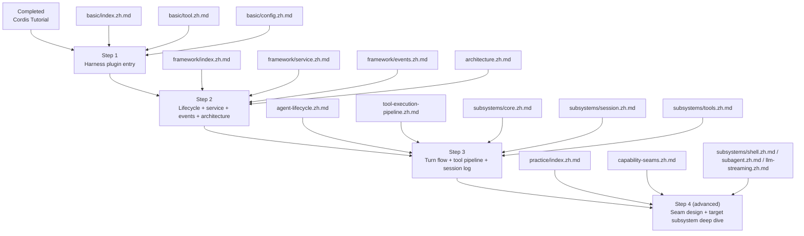
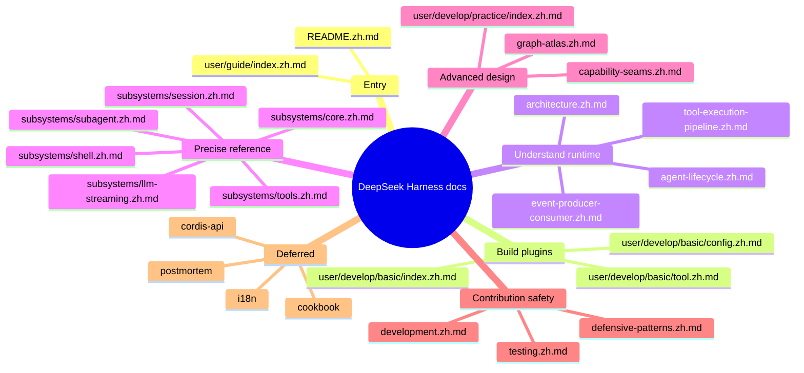
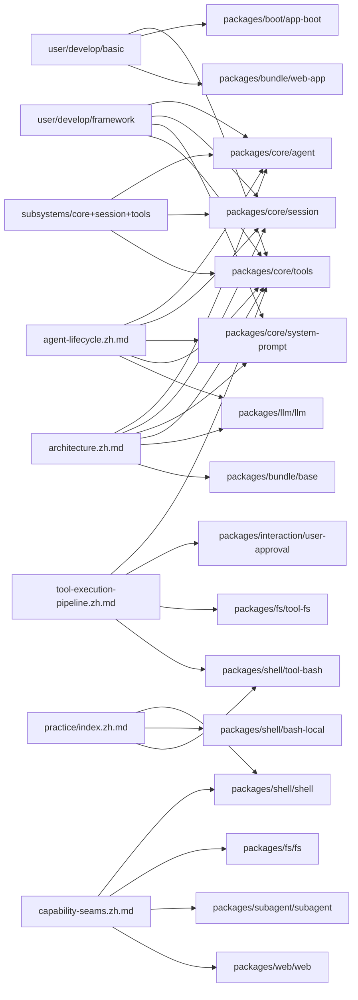
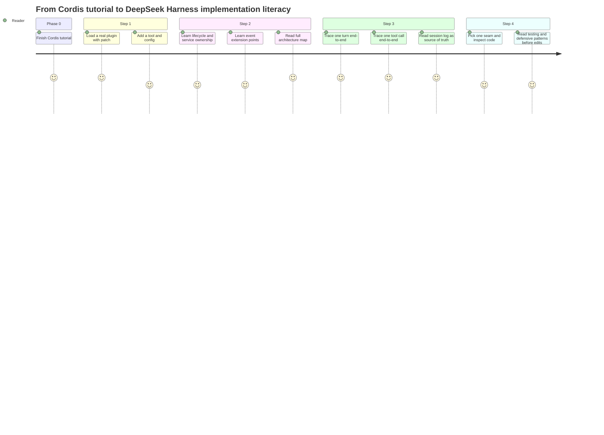

# Docs Analysis and Learning Path

## Goal

Build a practical learning route through the `docs/` corpus for a reader who has already completed [`docs/cordis-tutorial/index.zh.md`](../docs/cordis-tutorial/index.zh.md), and now wants to understand how real DeepSeek Harness code is assembled, extended, and verified.

## Method

1. Read the repo entry and the root overview/reference docs first.
2. Treat `docs/` subdirectories as topic categories.
3. Ignore English duplicates when a `.zh.md` counterpart exists.
4. Use a sub-agent to map the next documents to the owning packages and code surfaces.

## High-Level Conclusion

If Cordis tutorial solved "how plugins work", the next learning problem is "how the harness composes many plugins into one agent product".

The best next 3 steps are:

1. **Harness plugin entry**: [`docs/user/develop/basic/index.zh.md`](../docs/user/develop/basic/index.zh.md) → [`docs/user/develop/basic/tool.zh.md`](../docs/user/develop/basic/tool.zh.md) → [`docs/user/develop/basic/config.zh.md`](../docs/user/develop/basic/config.zh.md)
2. **Harness plugin lifecycle and extension points**: [`docs/user/develop/framework/index.zh.md`](../docs/user/develop/framework/index.zh.md) → [`docs/user/develop/framework/service.zh.md`](../docs/user/develop/framework/service.zh.md) → [`docs/user/develop/framework/events.zh.md`](../docs/user/develop/framework/events.zh.md) → [`docs/architecture.zh.md`](../docs/architecture.zh.md)
3. **Runtime execution path and source of truth**: [`docs/agent-lifecycle.zh.md`](../docs/agent-lifecycle.zh.md) → [`docs/tool-execution-pipeline.zh.md`](../docs/tool-execution-pipeline.zh.md) → [`docs/subsystems/core.zh.md`](../docs/subsystems/core.zh.md) → [`docs/subsystems/session.zh.md`](../docs/subsystems/session.zh.md) → [`docs/subsystems/tools.zh.md`](../docs/subsystems/tools.zh.md)

## Why These Are the Best Next 3 Steps

### Step 1: Harness plugin entry

This step upgrades your mental model from "Cordis plugin in a toy runtime" to "plugin loaded into the real DSH product". It introduces `--patch`, Web UI loading, model-facing tools, and plugin configuration.

**Main docs**

- [`docs/user/develop/basic/index.zh.md`](../docs/user/develop/basic/index.zh.md)
- [`docs/user/develop/basic/tool.zh.md`](../docs/user/develop/basic/tool.zh.md)
- [`docs/user/develop/basic/config.zh.md`](../docs/user/develop/basic/config.zh.md)

**Owning code surfaces**

- `packages/core/tools`
- `packages/boot/app-boot`
- `packages/bundle/web-app`

**Learning outcome**

You can mount a local plugin, understand where it appears in the real app, and see how DSH turns Cordis primitives into product behavior.

### Step 2: Harness plugin lifecycle and extension points

This step explains what makes DSH different from a generic plugin runtime: service ownership, dependency-driven loading, reload safety, event-based extension points, and where new behavior belongs.

**Main docs**

- [`docs/user/develop/framework/index.zh.md`](../docs/user/develop/framework/index.zh.md)
- [`docs/user/develop/framework/service.zh.md`](../docs/user/develop/framework/service.zh.md)
- [`docs/user/develop/framework/events.zh.md`](../docs/user/develop/framework/events.zh.md)
- [`docs/architecture.zh.md`](../docs/architecture.zh.md)

**Owning code surfaces**

- `packages/core/agent`
- `packages/core/agent-loop`
- `packages/core/session`
- `packages/core/system-prompt`
- `packages/core/tools`

**Learning outcome**

You can tell whether a feature belongs in a service, an event listener, a tool, or a bundle layer, and you can trace the core spine of one running agent.

### Step 3: Runtime execution path and source of truth

This step turns the big-picture architecture into a debuggable runtime path. It answers three critical questions: how a turn runs, how a tool call is guarded, and where durable truth lives.

**Main docs**

- [`docs/agent-lifecycle.zh.md`](../docs/agent-lifecycle.zh.md)
- [`docs/tool-execution-pipeline.zh.md`](../docs/tool-execution-pipeline.zh.md)
- [`docs/subsystems/core.zh.md`](../docs/subsystems/core.zh.md)
- [`docs/subsystems/session.zh.md`](../docs/subsystems/session.zh.md)
- [`docs/subsystems/tools.zh.md`](../docs/subsystems/tools.zh.md)

**Owning code surfaces**

- `packages/core/agent-loop`
- `packages/core/agent`
- `packages/core/session`
- `packages/core/system-prompt`
- `packages/core/tools`
- `packages/llm/llm`

**Learning outcome**

You can trace one message from inbox to session log, model request, tool execution, and back to replayable history.

## Recommended Roadmap

## Knowledge Blocks

| Block | Main question | Best docs | Typical code owners |
|---|---|---|---|
| Plugin entry | How do I mount one plugin into the real app? | `user/develop/basic/*` | `packages/boot/*`, `packages/bundle/*`, `packages/core/tools` |
| Plugin lifecycle | When does a plugin load, reload, and clean up? | `user/develop/framework/index.zh.md`, `cordis-primer.zh.md` | `packages/core/*`, Cordis integration points |
| Service design | When should behavior live on `ctx.<key>`? | `user/develop/framework/service.zh.md`, `capability-seams.zh.md` | the owning seam package |
| Event extension | Which event do I hook, and why? | `user/develop/framework/events.zh.md`, `event-producer-consumer.zh.md`, `architecture.zh.md` | producer package plus listener packages |
| Agent runtime | What is a turn, a step, and a replayable fact? | `architecture.zh.md`, `agent-lifecycle.zh.md`, `subsystems/core.zh.md`, `subsystems/session.zh.md` | `packages/core/agent*`, `packages/core/session`, `packages/llm/llm` |
| Tool execution | What guards and rewrites a tool call? | `tool-execution-pipeline.zh.md`, `subsystems/tools.zh.md` | `packages/core/tools`, tool packages, policy packages |
| Capability seams | How do definition/provider/consumer split? | `user/develop/practice/index.zh.md`, `capability-seams.zh.md` | seam packages such as `shell`, `fs`, `subagent`, `web` |
| Quality and operations | How do I validate behavior safely? | `development.zh.md`, `testing.zh.md`, `defensive-patterns.zh.md` | build/test/support packages |

## Docs-to-Code Map

## Suggested Study Rhythm

## What to Read Later, Not Now

### Defer until you start modifying code

- `docs/cookbook/*`: task playbooks are most useful once you have a concrete change in hand.
- `docs/testing.zh.md`: important, but highest ROI after the runtime model is clear.
- `docs/defensive-patterns.zh.md`: important before concurrency, lifecycle, or subprocess work.

### Defer until you need exact lookup

- `docs/cordis-api/*`
- `docs/config-catalog.zh.md`
- `docs/tool-catalog.zh.md`
- `docs/persistence-catalog.zh.md`
- `docs/module-graph.zh.md`

### Defer until you hit a matching problem class

- `docs/postmortem/*`
- `docs/i18n/*`
- `docs/web-styling.zh.md`
- `docs/rescope.zh.md`

## Recommended First Code-Reading Targets

After finishing the next 3 steps, inspect code in this order:

1. `packages/core/tools`
2. `packages/core/agent`
3. `packages/core/agent-loop`
4. `packages/core/session`
5. `packages/llm/llm`
6. One concrete seam trio:
   - `packages/shell/shell`
   - `packages/shell/bash-local`
   - `packages/shell/tool-bash`

This order mirrors the docs path:

- tool authoring,
- agent runtime,
- durable session truth,
- shared LLM vocabulary,
- seam-based capability design.

## Final Recommendation

If your immediate goal is **learning DSH implementation**, not just using the product, then the shortest high-value route is:

1. `user/develop/basic`
2. `user/develop/framework`
3. `architecture` + `agent-lifecycle` + `tool-execution-pipeline` + `subsystems/{core,session,tools}`

If your goal then shifts from **understanding** to **building**, the next jump is:

4. `user/develop/practice`
5. `capability-seams`
6. one concrete seam such as `shell`, `subagent`, or `web`
